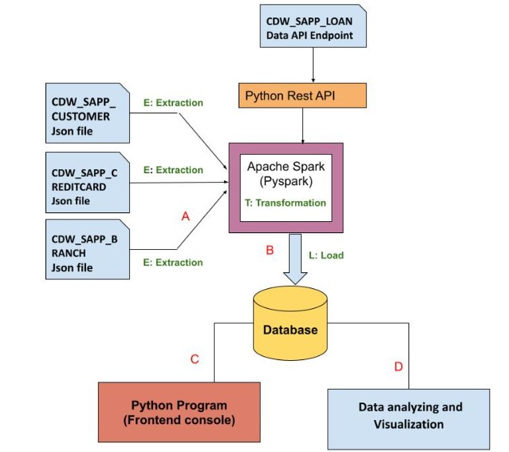
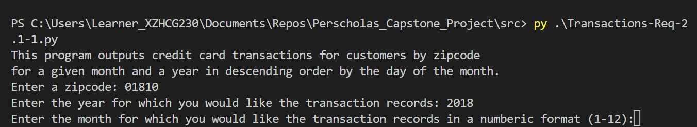
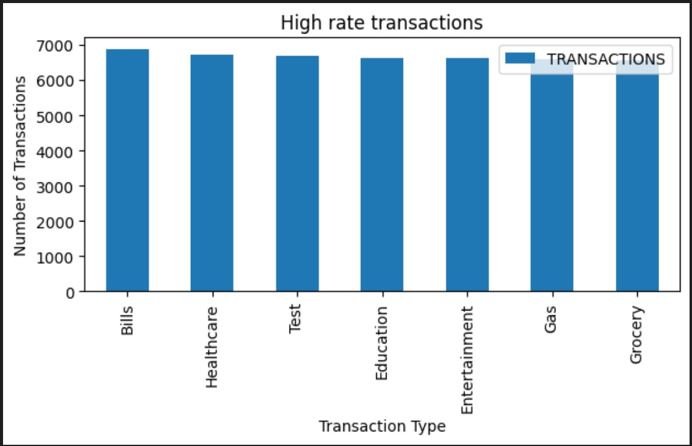
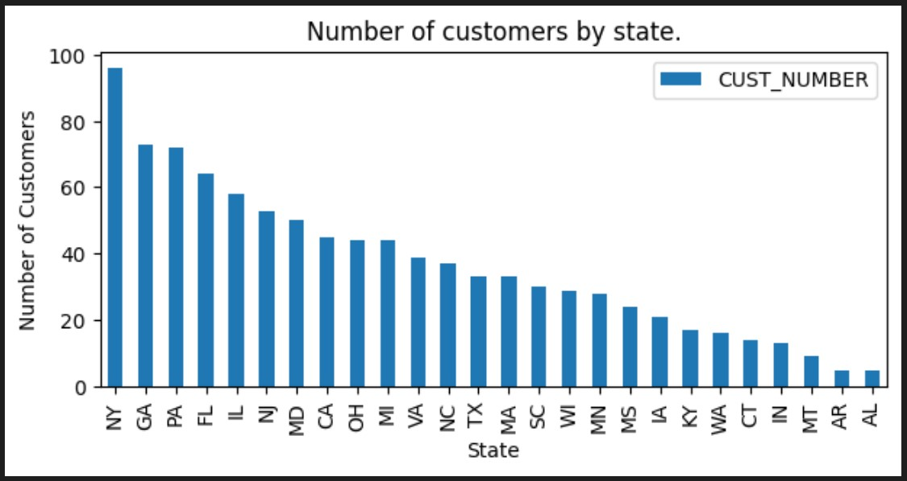
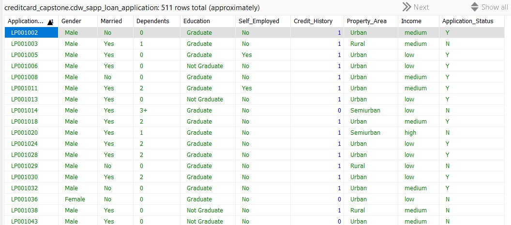
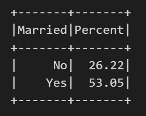
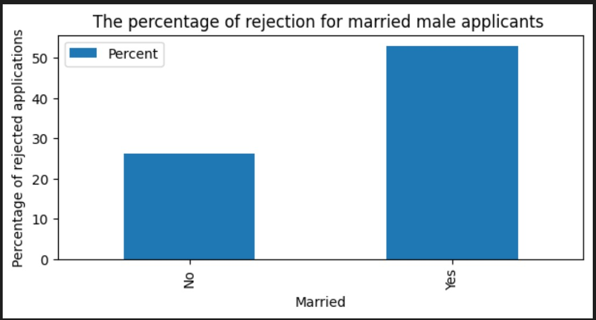

<!-- TABLE OF CONTENTS -->

  
Table of Contents

  <ol>
    <li><a href="#1-load-credit-card-database">Load Credit Card Database (SQL)</a></li>
    <li><a href="#2-application-front-end">Application Front-End</a></li>
    <li><a href="#3-data-analysis-and-visualization">Data Analysis and Visualization</a></li>
    <li><a href="#4-loan-application-dataset">LOAN Application Dataset</a></li>
    <li><a href="#5-data-analysis-and-visualization-for-loan-application">Data Analysis and Visualization for Loan Application</a></li>
  </ol>

## CAPSTONE PROJECT

This Capstone Project required me to work with the following technologies to manage an ETL process for a Loan Application dataset and a Credit Card dataset: Python (Pandas, advanced modules e.g., Matplotlib), MariaDB, Apache Spark (Spark Core, Spark SQL), and Python Visualization and Analytics libraries.

Workflow Diagram

    

<!-- LoadCreditCardData -->
### 1. Load Credit Card Database

For this application I created a Python and PySpark SQL program to read/extract the data from existing JSON files and load it onto the SQL Database according to the specifications found in the mapping document.

<!-- ApplicationFrontEnd -->
### 2. Application Front-End

This application displays the data to the user which was loaded onto the database in the previous application. It also asks for user input based on which data is selected/manipulated.

    

<!-- DataAnalysisVisualization -->
### 3. Data Analysis and Visualization

In addition to quering the database and displaying/updating the data using spark dataframe, this application also visualized the data in the form of plots using Matplotlib. 

* Number of transactions per category from the highest to the lowest.

    

* Number of Customers by State.

    

<!-- LoanApplicationDataset -->
### 4. LOAN Application Dataset

This application sends an HTTP request to an API endpoint, receives JSON response and loads the data to the SQL database. 

    

<!-- LoanApplicationVisualization -->
### 5. Data Analysis and Visualization for Loan Application

This application queries the data that was created in the previous application. It also visualizes the data in the forms of plots. 

* Percentage of rejection for married male applicants.

    

    

<!-- CONTACT -->
## Contact

Gunel Murad - [@gunelmurad](https://www.linkedin.com/in/gunelmurad/) - gunelmurad@gmail.com

Project Link: [https://github.com/gunelmurad/Perscholas_Capstone_Project](https://github.com/gunelmurad/Perscholas_Capstone_Project)

(<a href="#readme-top">back to top</a>)
